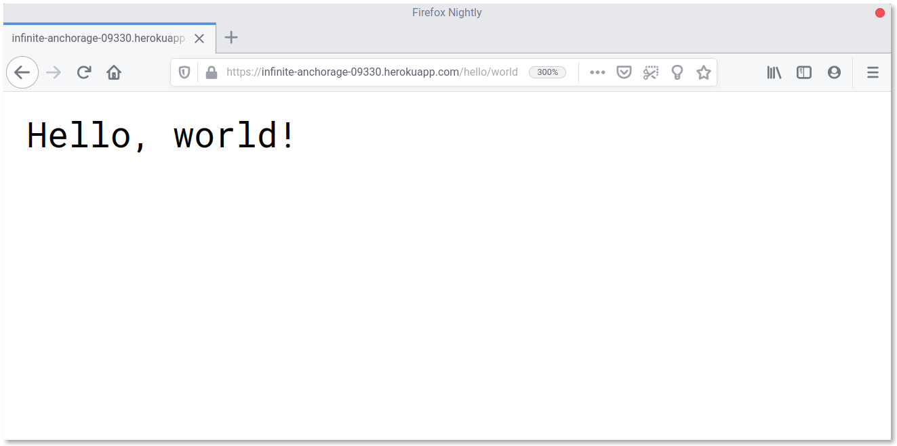

# Haskell on Heroku

## Development

Ensure you have [Nix](https://nixos.org/nix) installed and run:

```
$ nix-shell -A env --command "runhaskell Main.hs"
```

You should now have a pretty great web site running. Point a web browser at [http://localhost:8000/hello/world](http://localhost:8000/hello/world) to see it.

## Deployment

1. Create a new Heroku App.

2. Ensure you have [Docker](https://www.docker.com/) installed and running.

3. Log into the heroku cli and container registry.

  ```
  $ nix-shell -p heroku
  $ heroku login
  $ heroku container:login
  ```

4. Run the deploy script with your Heroku App name.

  ```
  $ ./deploy infinite-anchorage-09330
  ```

5. Open a browser and see it in action.

  [https://infinite-anchorage-09330.herokuapp.com/hello/world](https://infinite-anchorage-09330.herokuapp.com/hello/world)

  
